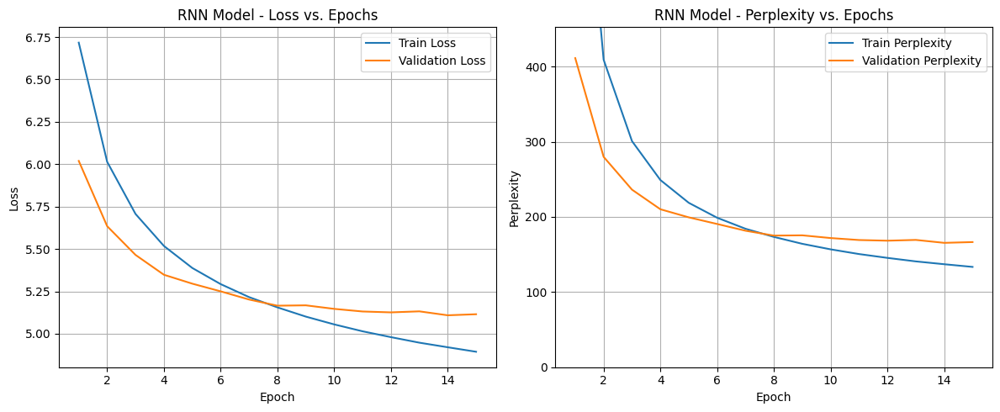
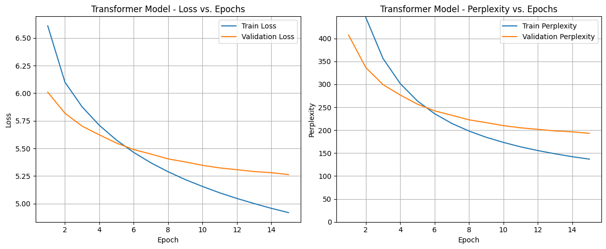
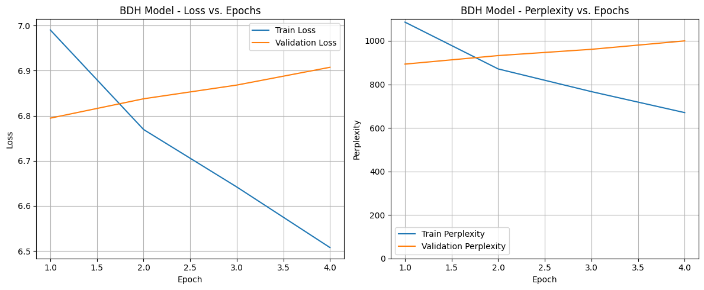

# Report: Comparison of Language Models (RNN vs. Transformer vs. BDH) for Causal Language Modeling

## 1. Objective

The goal of this project was to implement, train, and evaluate three different neural network architectures for the task
of causal language modeling (predicting the next token): a Recurrent Neural Network (RNN) using LSTM cells, a
Transformer-based model, and the Baby Dragon Hatchling (BDH) model. The models were compared based on their perplexity
on a held-out dataset and their time efficiency during training and inference.

## 2. Dataset and Preprocessing

* **Dataset:** WikiText-2 ('wikitext', 'wikitext-2-v1' version from Hugging Face `datasets`). This corpus consists of
  Wikipedia articles.
* **Tokenization:** A custom `basic_english_tokenizer` was used, splitting text into lowercase words and punctuation
  based on regex `r"[\w']+|[.,!?;=]"`.
* **Vocabulary:** Built from the training split using tokens appearing at least 3 times. Special tokens (`<unk>`,
  `<pad>`, `<bos>`, `<eos>`) were added.
    * **Vocabulary Size:** 28,752 tokens.
* **Processing:** Raw text lines were tokenized, converted to numerical indices (using `<unk>` for out-of-vocabulary
  tokens), and an `<eos>` token was appended to each processed line/article segment. Empty lines were skipped. The
  resulting sequences of indices were concatenated into a single flat tensor for each split (train, validation, test).
* **Batching:** The flat tensor data was reshaped into batches using a `batchify` function, resulting in tensors of
  shape `[sequence_length, batch_size]`.
    * Train Batch Size: 32
    * Validation/Test Batch Size: 16
    * Train Data Shape: `[62421, 32]`
    * Validation Data Shape: `[13063, 16]`
    * Test Data Shape: `[14702, 16]`
* **Sequence Length (BPTT):** During training and evaluation, the data was processed in chunks of length `bptt = 35`.

## 3. Hardware Used

* **Device:** Apple M3 Pro
* **PyTorch Backend:** MPS (Metal Performance Shaders)

## 4. Model Architectures

The models were configured to have roughly comparable parameter counts (~25-28 Million) for a fair comparison.

### 4.1. RNN (LSTM)

* **Type:** Multi-layer LSTM
* **Parameters:**
    * Embedding Size (`embed_size`): 256
    * Hidden Size (`hidden_size_rnn`): 512
    * Number of Layers (`num_layers_rnn`): 3
    * Dropout: 0.5
* **Total Trainable Parameters:** 27,889,744
* **Optimizer:** SGD
* **Learning Rate:** Initial `lr_rnn = 15.0`
* **Scheduler:** `ReduceLROnPlateau` (factor=0.5, patience=2)
* **Gradient Clipping:** 0.2

### 4.2. Transformer

* **Type:** Transformer Encoder with causal masking
* **Parameters:**
    * Embedding Size (`embed_size`): 256
    * Number of Attention Heads (`nhead_transformer`): 4
    * Feed-Forward Hidden Size (`hidden_size_transformer`): 2048
    * Number of Layers (`num_layers_transformer`): 8
    * Dropout: 0.5
* **Total Trainable Parameters:** 25,270,352
* **Optimizer:** AdamW
* **Learning Rate:** `lr_transformer = 0.0002`
* **Weight Decay:** 0.01
* **Scheduler:** `StepLR` (gamma=0.95, step_size=1)
* **Gradient Clipping:** 0.2

### 4.3. BDH (Baby Dragon Hatchling)

* **Type:** BDH Architecture (details in `bdh.py`)
* **Parameters:**
    * Embedding Size (`n_embd`): 256
    * Number of Heads (`n_head`): 4
    * MLP Multiplier (`mlp_internal_dim_multiplier`): 64 (Resulting 'neuron' dim per head: 4096)
    * Number of Layers (`n_layer`): 4
    * Dropout: 0.5
* **Total Trainable Parameters:** 27,303,936
* **Optimizer:** AdamW
* **Learning Rate:** `lr_bdh` = 0.0003
* **Weight Decay:** 0.01
* **Scheduler:** `StepLR` (gamma=0.95, step_size=1)
* **Gradient Clipping:** 0.2

## 5. Evaluation Results

Models were trained for up to 15 epochs (BDH was stopped early after 4 epochs due to overfitting). The best model
checkpoint based on validation perplexity was saved and used for the final test evaluation and inference.

| Metric                          | RNN (LSTM) | Transformer | BDH        |
|:--------------------------------|:-----------|:------------|:-----------|
| Trainable Parameters            | 27,889,744 | 25,270,352  | 27,303,936 |
| Best Valid Perplexity           | 165.48     | 193.12      | 893.03     |
| **Final Test Perplexity**       | **157.25** | **180.97**  | **846.99** |
| Total Training Time (s)         | 1879.18    | 2550.82     | 4939.64    |
| Inference Time (s) [10 prompts] | 0.30       | 1.61        | 8.83       |

### Loss and Perplexity Plots

**RNN Model:**

**Transformer Model:**

**BDH Model:**

## 6. Comparison of Prompt Completions

The following shows the generated text (up to 50 tokens) for 10 standard prompts using the best checkpoint for each
model.

**RNN (LSTM) Output:**

1. **PROMPT:** The best way to...
   **OUTPUT:** the best way to be the first to be the first to be the first to be the first to be the first to be the
   first to be the first to be the first to be the first to be the first to be the first to be the first to be the <eos>
2. **PROMPT:** Once upon a time...
   **OUTPUT:** once upon a time . <eos>
3. **PROMPT:** In a surprising turn of events...
   **OUTPUT:** in a surprising turn of events . <eos>
4. **PROMPT:** The report concluded that...
   **OUTPUT:** the report concluded that the unk of the unk was the first to be the first to be the first to be the
   first . <eos>
5. **PROMPT:** Technology has changed...
   **OUTPUT:** technology has changed to the unk , and the unk of the unk unk unk unk unk unk unk unk unk unk unk unk
   unk unk unk unk unk unk unk unk unk unk unk unk unk unk unk unk unk unk unk unk unk unk unk unk unk unk unk unk
   unk <eos>
6. **PROMPT:** The main difference between...
   **OUTPUT:** the main difference between the unk and unk . <eos>
7. **PROMPT:** When the capital was...
   **OUTPUT:** when the capital was released . <eos>
8. **PROMPT:** He opened the door and...
   **OUTPUT:** he opened the door and the unk , and the unk , the unk , was the first to be the first to be a
   unk . <eos>
9. **PROMPT:** The system is designed to...
   **OUTPUT:** the system is designed to be a unk . <eos>
10. **PROMPT:** This research suggests that...
    **OUTPUT:** this research suggests that the unk of the unk was the first to be the first to be the first . <eos>

**Transformer Output:**

1. **PROMPT:** The best way to...
   **OUTPUT:** the best way to be a series of the series . <eos>
2. **PROMPT:** Once upon a time...
   **OUTPUT:** once upon a time , he was unable to be able to be a unk . <eos>
3. **PROMPT:** In a surprising turn of events...
   **OUTPUT:** in a surprising turn of events . <eos>
4. **PROMPT:** The report concluded that...
   **OUTPUT:** the report concluded that the jin had been the first army of the jin , and the jin had been captured by
   the jin . <eos>
5. **PROMPT:** Technology has changed...
   **OUTPUT:** technology has changed to the unk of the unk unk unk unk unk unk unk unk unk unk unk unk unk unk unk unk
   unk unk unk unk unk unk unk unk unk unk unk unk unk unk unk unk unk unk unk unk unk unk unk unk unk unk unk unk
   unk <eos>
6. **PROMPT:** The main difference between...
   **OUTPUT:** the main difference between the nasals and the nasals are not used to be used . <eos>
7. **PROMPT:** When the capital was...
   **OUTPUT:** when the capital was not able to be able to be the first time . <eos>
8. **PROMPT:** He opened the door and...
   **OUTPUT:** he opened the door and was not a series of the series . <eos>
9. **PROMPT:** The system is designed to...
   **OUTPUT:** the system is designed to be used for the site . <eos>
10. **PROMPT:** This research suggests that...
    **OUTPUT:** this research suggests that the cathedral is not a unk , and the unk of the cathedral is not a
    unk . <eos>

**BDH Output:**

1. **PROMPT:** The best way to...
   **OUTPUT:** the best way to the , the , the , the ,
   the , , , , , , , , , , , , , , , , , , , , , , , , , , , , , , , , , , , , , , , , , <eos>
2. **PROMPT:** Once upon a time...
   **OUTPUT:** once upon a
   time , , , , , , , , , , , , , , , , , , , , , , , , , , , , , , , , , , , , , , , , , , , , , , , , , , <eos>
3. **PROMPT:** In a surprising turn of events...
   **OUTPUT:** in a surprising turn of events
   the , , , , , , , , , , , , , , , , , , , , , , , , , , , , , , , , , , , , , , , , , , , , , , , , , <eos>
4. **PROMPT:** The report concluded that...
   **OUTPUT:** the report concluded that the , the , the , the , the ,
   the , , , , , , , , , , , , , , , , , , , , , , , , , , , , , , , , , , , , , , , <eos>
5. **PROMPT:** Technology has changed...
   **OUTPUT:** technology has
   changed , , , , , , , , , , , , , , , , , , , , , , , , , , , , , , , , , , , , , , , , , , , , , , , , , , <eos>
6. **PROMPT:** The main difference between...
   **OUTPUT:** the main difference between the , the , the ,
   the , , , , , , , , , , , , , , , , , , , , , , , , , , , , , , , , , , , , , , , , , , , <eos>
7. **PROMPT:** When the capital was...
   **OUTPUT:** when the capital was the , the , the , the , the ,
   the , , , , , , , , , , , , , , , , , , , , , , , , , , , , , , , , , , , , , , , <eos>
8. **PROMPT:** He opened the door and...
   **OUTPUT:** he opened the door
   and , , , , , , , , , , , , , , , , , , , , , , , , , , , , , , , , , , , , , , , , , , , , , , , , , , <eos>
9. **PROMPT:** The system is designed to...
   **OUTPUT:** the system is designed to the ,
   the , , , , , , , , , , , , , , , , , , , , , , , , , , , , , , , , , , , , , , , , , , , , , , , <eos>
10. **PROMPT:** This research suggests that...
    **OUTPUT:** this research suggests that the ,
    the , , , , , , , , , , , , , , , , , , , , , , , , , , , , , , , , , , , , , , , , , , , , , , , <eos>

**Interpretation:**

* **RNN (LSTM):** Achieved the lowest test perplexity (157.25). However, its generated text shows significant issues:
  repetition, over-reliance on `<unk>`, and often terminating very quickly. Suggests good prediction of common sequences
  but poor generative ability for diverse, longer text. Very fast inference.
* **Transformer:** Higher test perplexity (180.97) but more coherent and less repetitive generated text than the RNN for
  several prompts (e.g., generating plausible phrases). Still produces `<unk>` tokens but less frequently than the RNN
  in structured output. Slower training and significantly slower inference than the RNN.
* **BDH:** Performed very poorly, achieving an extremely high test perplexity (846.99) using the best checkpoint (Epoch
  1). The model began overfitting immediately after the first epoch, with validation perplexity increasing in subsequent
  epochs. The generated text consists almost entirely of repeating commas or 'the', indicating a complete failure to
  learn meaningful patterns. Inference time was also the slowest by a significant margin.

## 7. Discussion and Insights

* **Performance vs. Quality:** The RNN (LSTM) achieved the best test perplexity, but the Transformer showed the best
  qualitative results in text generation. BDH performed worst on both metrics by a large margin. This highlights that
  perplexity alone doesn't capture all aspects of generation quality, as the RNN frequently collapsed into repetitive or
  `<unk>` outputs, and BDH failed to produce meaningful text.
* **Time Efficiency:**
    * The RNN was the fastest in both training and inference.
    * The Transformer was slower to train and infer than the RNN, likely due to the computational cost of its 8
      self-attention layers.
    * **BDH Training Time & Cost:** BDH was extremely slow to train, taking ~20 minutes per epoch compared to ~2 minutes
      for the others. This is attributed to the large intermediate 'neuron' dimension (16,384) used in its matrix
      multiplications. Inference was also significantly slower (8.83s). This high computational cost makes BDH
      challenging to train and tune effectively.
    * **Resource Constraints:** Training times were considerable on the available M3 Pro hardware, limiting the extent
      of hyperparameter search and the number of epochs feasible within the project's time constraints, especially
      impacting the exploration of BDH.
* **Implementation Challenges & Tuning:**
    * **RNN Tuning:** Achieving stable and effective training for the RNN proved challenging, requiring significant
      effort to find a suitable optimizer (SGD), high initial learning rate (`15.0`), and scheduler (
      `ReduceLROnPlateau`). Despite achieving the lowest perplexity, the final generation quality remained poor. More
      time was dedicated to tuning the RNN compared to the Transformer.
    * **Transformer Overfitting & Potential:** The Transformer was prone to overfitting, necessitating a high dropout
      rate (0.5). Given limited tuning time focused on the RNN, further optimization (learning rate schedule,
      regularization) might have improved its perplexity, potentially surpassing the RNN.
    * **BDH Overfitting & Tuning:** BDH started overfitting almost immediately (after Epoch 1), indicated by the rising
      validation loss/perplexity. The extremely poor performance suggests the current hyperparameters (learning rate,
      dropout 0.5, weight decay 0.01) are not suitable, and it likely requires much stronger regularization or a
      different tuning strategy. Due to the very long training times and limited budget, further runs to optimize BDH
      were not feasible.
    * Balancing parameter counts required careful adjustment of different hyperparameters for each architecture.

## 8. Conclusion

In this comparison, the **RNN (LSTM)** achieved the lowest test perplexity (157.25) and was the most time-efficient.
However, its practical utility was limited by poor generation quality, characterized by repetition and `<unk>` tokens,
despite extensive tuning efforts.

The **Transformer** model, while having a higher test perplexity (180.97) and being slower, produced significantly more
coherent and diverse text, demonstrating better generative capabilities. Its susceptibility to overfitting required
strong regularization, and further tuning might improve its perplexity score.

The **BDH** model performed poorly in this configuration, exhibiting immediate overfitting, very high perplexity (
846.99), extremely slow training/inference, and generating meaningless text. This suggests the chosen hyperparameters
were inadequate, and the architecture might require significant tuning or stronger regularization (like increased
dropout) to learn effectively. Due to resource constraints and the model's high computational cost, further optimization
was not possible.

Overall, the Transformer demonstrated the best balance of perplexity and generation quality in this experiment, although
the RNN was superior in terms of perplexity score and speed. BDH, in its current state and with the attempted
parameters, was not competitive.
