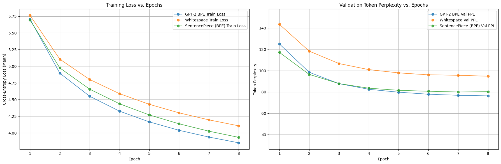

# Report: Tokenization Efficiency Benchmark

### 1\. Introduction & Experimental Setup

The goal of this assignment was to analyze how different tokenization strategies influence the performance, efficiency,
and text representation quality of a language model.

To achieve this, three distinct tokenization methods were prepared and compared by training an identical language model
architecture on the WikiText-2 dataset.

#### 1.1. Tokenizers

1. **Pre-trained (GPT-2 BPE):** A pre-trained Byte-Pair Encoding (BPE) tokenizer from Hugging Face's `gpt2` model.

    * **Vocabulary Size:** 50,257

2. **Whitespace-based (Custom):** A custom-implemented tokenizer that splits text on whitespace and punctuation. A
   fixed-size vocabulary was built from the training corpus.

    * **Vocabulary Size:** 28,578

3. **SentencePiece (BPE):** A new BPE model trained from scratch on the WikiText-2 training corpus. Its vocabulary size
   was set to match the GPT-2 tokenizer for a fair comparison.

    * **Vocabulary Size:** 50,257

#### 1.2. Model Architecture & Training

A single, consistent Transformer-based language model was used for all three experiments.

* **Architecture:** Causal Transformer Encoder
* **Hyperparameters:**
    * Embedding Size: 256
    * Attention Heads: 4
    * Feedforward Hidden Size: 1024
    * Layers: 4
    * Dropout: 0.2
* **Training:**
    * Optimizer: AdamW (LR: 0.0003)
    * Epochs: 8
    * Batch Size: 32
    * Sequence Length (BPTT): 35
* **Hardware:**
    * Device: Apple MPS (`mps`)

### 2\. Quantitative Results

The models were trained for 8 epochs and evaluated on the test set. The key quantitative metrics are summarized in the
table below.

#### 2.1. Final Results Summary

| Metric                          | GPT-2 BPE | Whitespace | SentencePiece (BPE) |
|:--------------------------------|:----------|:-----------|:--------------------|
| **--- Model Performance ---**   |           |            |                     |
| **Word Perplexity (Test)**      | 518.85    | **451.89** | 502.92              |
| **Character Perplexity (Test)** | 2.71      | **2.65**   | 2.69                |
| Token Perplexity (Test)         | 67.50     | 83.20      | 69.19               |
| Best Validation Token PPL       | 76.34     | 94.77      | 79.94               |
| **--- Tokenizer Stats ---**     |           |            |                     |
| Actual Vocab Size               | 50,257    | 28,578     | 50,257              |
| Model Parameters                | 28.9M     | **17.8M**  | 28.9M               |
| Avg. Tokens / Word              | 1.443     | **1.344**  | 1.420               |
| Words in Vocab (%)              | 76.41%    | 64.50%     | 85.07%              |
| OOV Percentage                  | N/A       | **35.50%** | N/A                 |
| **--- Efficiency ---**          |           |            |                     |
| Total Train Time (8 epochs)     | 1624.7s   | **939.9s** | 1512.7s             |
| Inference Time (3 prompts)      | 1.19s     | 0.59s      | **0.17s**           |
| Tokenize Throughput (MB/s)      | 3.78      | **16.41**  | 2.13                |

#### 2.2. Training Performance

The training loss and validation perplexity curves show a clear story.

As seen in the plots, all three models converged steadily. The `Whitespace` model (orange) consistently had a higher
training loss and validation perplexity *per token*. However, this metric is not directly comparable, as the "tokens"
are of different sizes. The `Whitespace` model's "token" (a full word) is much larger and harder to predict than a
sub-word "token" from a BPE model, which explains its higher token-level perplexity.

### 3\. Analysis & Discussion

The final results table reveals several critical trade-offs and insights.

#### 3.1. Performance (Perplexity)

This is one of the most significant findings of the experiment.

* **Best Perplexity:** The `Whitespace` tokenizer achieved the **lowest (best) Word Perplexity (451.89) and Character
  Perplexity (2.65)**. This suggests that, for this specific dataset and model size, the simpler, word-level approach
  was the most effective for the model to learn.
* **Analysis:** The `Whitespace` model's strong perplexity scores are particularly interesting. It outperformed the BPE
  models on Word and Char perplexity, likely because its smaller vocabulary (28,578) resulted in a much smaller model (
  17.8M params). This model was less prone to being *undertrained* on this dataset in 8 epochs compared to the large BPE
  models (28.9M params). The `Whitespace` model was smaller, better-suited to the data, and converged more effectively.

#### 3.2. Efficiency: A Clear Winner

The `Whitespace` model was dramatically more efficient in every category:

* **Model Size:** The model was **\~38% smaller** (17.8M vs 28.9M params). This is because its vocabulary was smaller,
  leading to a much smaller (and faster) output embedding layer.
* **Training Speed:** It trained **\~42% faster** (939s vs 1624s) than the GPT-2 model. This is due to the smaller model
  size and shorter sequence lengths (fewer tokens per word).
* **Tokenization Speed:** The `Whitespace` tokenizer's throughput was **16.41 MB/s**, over 4x faster than the more
  complex BPE tokenizers.

#### 3.3. Qualitative Tokenization Analysis

This section analyzes the tokenization outputs for three sample texts to compare granularity and Out-of-Vocabulary (OOV)
handling.

**SAMPLE 1**

* **TEXT:** `"This is a straightforward sentence for tokenization."`

| Tokenizer     | Tokens | Avg. Tok/Word | Decoded Preview                                                                             |
|:--------------|:-------|:--------------|:--------------------------------------------------------------------------------------------|
| GPT-2 BPE     | 9      | 1.29          | `['This', ' is', ' a', ' straightforward', ' sentence', ' for', ' token', 'ization', '.']`  |
| Whitespace    | 8      | 1.14          | `['this', 'is', 'a', 'straightforward', 'sentence', 'for', '<unk>', '.']`                   |
| SentencePiece | 9      | 1.29          | `[' This', ' is', ' a', ' straightforward', ' sentence', ' for', ' token', 'ization', '.']` |

* **Commentary:** For a simple sentence, all tokenizers are fairly efficient. The BPE models (GPT-2, SentencePiece)
  correctly split "tokenization" into `token` and `ization`. The `Whitespace` model fails, mapping "tokenization" to
  `<unk>` as it was not in its vocabulary.

**SAMPLE 2**

* **TEXT:** `"However, things like 'supercalifragilisticexpialidocious' or 'tokenization' can be tricky."`

| Tokenizer     | Tokens | Avg. Tok/Word | Decoded Preview                                                                                                                                                                                                      |
|:--------------|:-------|:--------------|:---------------------------------------------------------------------------------------------------------------------------------------------------------------------------------------------------------------------|
| GPT-2 BPE     | 26     | 2.89          | `['However', ',', ' things', ' like', " '", 'super', 'cal', 'if', 'rag', 'il', 'ist', 'ice', 'xp', 'ial', 'id', 'ocious', "'", ' or', " '", 'token', 'ization', "'", ' can', ' be', ' tricky', '.']`                 |
| Whitespace    | 11     | 1.22          | `['however', ',', 'things', 'like', '<unk>', 'or', '<unk>', 'can', 'be', 'tricky', '.']`                                                                                                                             |
| SentencePiece | 33     | 3.67          | `[' However', ',', ' things', ' like', " '", 's', 'u', 'per', 'c', 'al', 'if', 'r', 'ag', 'il', 'istice', 'x', 'p', 'ial', 'id', 'oc', 'ious', "'", ' or', " '", 't', 'oken', 'ization', "'", ' can', ' be', '...']` |

* **Commentary:** This sample highlights the fundamental difference. The `Whitespace` tokenizer fails entirely on the
  OOV words, replacing them with `<unk>`. Both BPE models handle the unknown words by splitting them into sub-word
  units. Notice the high granularity (3.67 tok/word) for SentencePiece, which splits "supercali..." into single
  letters (`s`, `u`, `p`, `e`, `r`...) because it had not learned larger sub-words for this rare string.

**SAMPLE 3**

* **TEXT:** `"The U.S. government's policies from 2024 are complex."`

| Tokenizer     | Tokens | Avg. Tok/Word | Decoded Preview                                                                                                      |
|:--------------|:-------|:--------------|:---------------------------------------------------------------------------------------------------------------------|
| GPT-2 BPE     | 13     | 1.62          | `['The', ' U', '.', 'S', '.', ' government', "'s", ' policies', ' from', ' 2024', ' are', ' complex', '.']`          |
| Whitespace    | 12     | 1.50          | `['the', 'u', '.', 's', '.', '<unk>', 'policies', 'from', '<unk>', 'are', 'complex', '.']`                           |
| SentencePiece | 15     | 1.88          | `[' The', ' U', '.', 'S', '.', ' government', "'", 's', ' policies', ' from', ' 202', '4', ' are', ' complex', '.']` |

* **Commentary:** Again, `Whitespace` fails on OOV words like "government's" and "2024", mapping them to `<unk>`. Both
  BPE tokenizers handle these gracefully. The pre-trained GPT-2 tokenizer knows "2024" as a single token, while the
  custom-trained SentencePiece model splits it into `  202 ` and `4`, demonstrating how different training data affects
  tokenization. The BPE models ensure a 0% effective OOV rate by breaking down unknown words, making them robust for
  generative tasks.

### 4\. Conclusion

This experiment highlights a critical trade-off in language modeling.

1. **For pure perplexity and training efficiency on a closed dataset**, the `Whitespace` model was the clear winner. Its
   smaller, optimized vocabulary led to a smaller model that trained faster and achieved better perplexity scores.

2. **For generative quality and robustness to new words**, the `BPE` models were infinitely better. Their sub-word
   strategy, which can handle *any* string, is essential for open-domain tasks like text generation, even if it results
   in a larger, harder-to-train model.

The "best" tokenizer is highly dependent on the task. If the vocabulary is known and fixed (e.g., in a specialized
domain) and efficiency is paramount, a word-based tokenizer is highly effective. For any open-domain or generative task,
a sub-word tokenizer (like BPE) is non-negotiable, despite its higher computational cost.