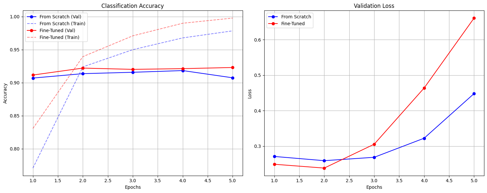

# Report: Fine-Tuning vs. From-Scratch Training for Text Classification

## 1\. Introduction

This report compares two approaches for training decoder-only language models on the **AG News** text classification
task:

1. **From-Scratch Training:** A small, custom Transformer decoder (\~3.4M parameters).
2. **Fine-Tuning:** A pre-trained `roneneldan/TinyStories-33M` model (\~68.5M parameters).

The objective is to analyze the trade-offs between performance (accuracy/F1) and efficiency (training/inference speed,
model size).

## 2\. Dataset Description

**Dataset:** [AG News](https://www.google.com/search?q=https://huggingface.co/datasets/ag_news)
**Task:** Topic Classification (4 classes: World, Sports, Business, Sci/Tech).

### 2.1 Statistics & Split

The dataset was split into Train, Validation, and Test sets. A 10% validation split was created from the original
training set.

| Split          | Number of Examples |
|:---------------|:-------------------|
| **Train**      | 108,000            |
| **Validation** | 12,000             |
| **Test**       | 7,600              |

### 2.2 Class Distribution

The dataset is perfectly balanced, ensuring that accuracy is a reliable metric.

* **Train:** \~27,000 examples per class.
* **Validation:** \~3,000 examples per class.

### 2.3 Preprocessing

* **Tokenization:** Both models utilized the `roneneldan/TinyStories-33M` tokenizer (GPT-2 based BPE) to ensure a fair
  comparison of vocabulary.
* **Sequence Length:** Truncated to `128` tokens to manage memory constraints.
* **Class Mapping:**
    * 0: World
    * 1: Sports
    * 2: Business
    * 3: Sci/Tech

## 3\. Model Descriptions

### 3.1 From-Scratch Model (Small Decoder)

A custom-built decoder-only Transformer designed to be lightweight.

* **Architecture:** `TransformerClassifier` (Custom `nn.Module`)
* **Type:** Decoder-only (Causal masking applied).
* **Classification Head:** Mean pooling over the sequence followed by a 2-layer MLP.
* **Configuration:**
    * Embedding Dimension: 64
    * Hidden Size: 256
    * Heads: 4
    * Layers: 4
    * Dropout: 0.1
* **Parameter Count:** **3,434,052 (\~3.4M)**

### 3.2 Fine-Tuned Model (Pre-trained)

* **Base Model:** `roneneldan/TinyStories-33M` (Hugging Face).
* **Architecture:** GPT-Neo style decoder-only transformer.
* **Pre-training:** Trained on a synthetic dataset of short stories containing only words that a 3-4 year old typically
  understands.
* **Classification Head:** Linear layer on top of the last token's hidden state.
* **Parameter Count:** **68,517,120 (\~68.5M)**

## 4\. Training & Evaluation Results

### 4.1 Training Dynamics

Both models were trained using the AdamW optimizer with a linear warmup. Early stopping was set with a patience of 3
epochs.

* **From-Scratch:** Trained for 5 epochs. Best validation loss was achieved at **Epoch 2** (0.2590).
* **Fine-Tuned:** Trained for 5 epochs. Best validation loss was achieved at **Epoch 2** (0.2381).

**Observations from Curves:**

* **Convergence:** The fine-tuned model converged rapidly, reaching peak performance almost immediately (Epoch 2).
* **Overfitting:** Both models exhibited signs of overfitting after Epoch 2, where validation loss began to increase
  while training loss continued to decrease. The fine-tuned model's validation loss degraded more sharply (from 0.23 to
  0.66), suggesting catastrophic forgetting or simple overfitting to the training noise given its larger capacity.

### 4.2 Quantitative Results Table

| Metric               | From-Scratch (Small)  | Fine-Tuned (TinyStories) |
|:---------------------|:----------------------|:-------------------------|
| **Test Accuracy**    | 91.51%                | **92.18%**               |
| **Test F1 Score**    | 91.44%                | **92.16%**               |
| **Parameters**       | \~3.4M                | \~68.5M                  |
| **Total Train Time** | **\~11.6 min** (697s) | \~90.4 min (5422s)       |
| **Inference Time**   | **2.3s**              | 22.8s                    |
| **Speedup Factor**   | **10x faster**        | 1x                       |

## 5\. Comparative Analysis

### 5.1 Performance vs. Size

The most striking result is how competitive the **From-Scratch** model is. Despite having **20x fewer parameters** (3.4M
vs 68.5M), it achieved an accuracy of **91.51%**, which is less than 1% lower than the Fine-Tuned model (**92.18%**).

**Why was the From-Scratch model so effective?**

1. **Task Simplicity:** AG News is a topic classification task with distinct vocabularies (e.g., "touchdown" for Sports
   vs "stocks" for Business). It does not require complex reasoning or world knowledge, which is where pre-trained
   models typically excel.
2. **Sufficient Capacity:** 3.4M parameters proved sufficient to learn the statistical patterns of this specific
   dataset.

### 5.2 Efficiency & Speed

The From-Scratch model dominates in efficiency:

* **Training:** It took \~11 minutes to train, compared to \~1.5 hours for the fine-tuned model on the same hardware.
* **Inference:** It is **10x faster** at inference (2.3s vs 22.8s for the test set). This makes the small scratch model
  significantly more viable for real-time applications or deployment on edge devices (mobile phones, IoT).

### 5.3 Stability & Overfitting

* **Fine-Tuned Instability:** The pre-trained model overfit aggressively after just 2 epochs. The validation loss spiked
  from 0.23 to 0.66. This indicates that even a "small" LLM like TinyStories (68M) has enough capacity to memorize the
  training data quickly, requiring aggressive regularization (higher dropout, weight decay) or fewer epochs.
* **Scratch Stability:** The scratch model also overfit, but the degradation was more gradual.

## 6\. Conclusion

This experiment demonstrates that **bigger is not always better**, especially for specific, narrower tasks like topic
classification.

* **Fine-Tuning** provided the absolute best metrics, leveraging its pre-trained knowledge of language structure.
* **From-Scratch** training provided a highly efficient, lightweight alternative that sacrificed negligible accuracy (
  \<0.7%) for a **10x gain in inference speed** and a massive reduction in memory footprint.

