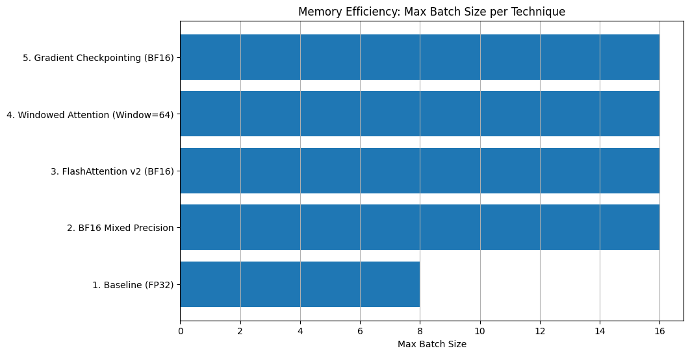
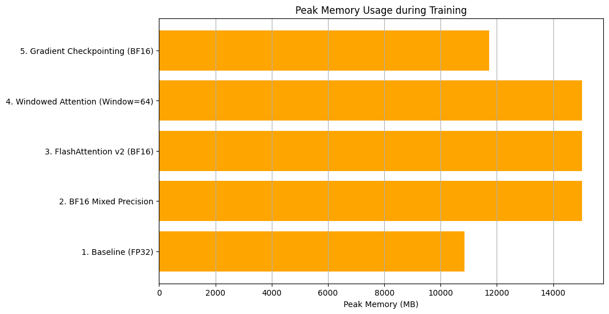

# Project Report: Memory-Efficient Transformer Training Techniques

## 1. Introduction

The objective of this experiment was to compare modern memory-optimization techniques for training Transformer models.
Using a GPT-style decoder-only architecture trained on the WikiText-2 dataset, we benchmarked five different training
regimes to analyze their impact on GPU memory usage, maximum achievable batch size, training speed, and model
performance (perplexity).

## 2. Experimental Setup

### Hardware & Environment

* **GPU:** NVIDIA L4 (24GB VRAM)
* **Framework:** PyTorch 2.9.0+cu126
* **Precision:** BF16 (Bfloat16) for optimizations, FP32 for baseline.

### Model Architecture

* **Type:** GPT-style Decoder-only Transformer
* **Hidden Dimension:** 512
* **Heads:** 8
* **Layers:** 6
* **Sequence Length:** 2048 (chosen to highlight attention bottlenecks)
* **Vocabulary Size:** 33,278

### Dataset

* **Dataset:** WikiText-2 (Word-level)
* **Train Tokens:** ~2.0M
* **Validation Tokens:** ~0.2M

## 3. Results

The following table summarizes the performance metrics for each technique after 1 epoch of training.

| Technique                     | Max Batch Size | Peak Memory (MB) | Step Time (ms) | Epoch Time (s) | Val PPL |
|-------------------------------|----------------|------------------|----------------|----------------|---------|
| **1. Baseline (FP32)**        | 8              | 10,851           | 587.83         | 70.72          | 273.84  |
| **2. BF16 Mixed Precision**   | 16             | 15,035           | 407.02         | 24.10          | 193.11  |
| **3. FlashAttention v2**      | 16             | 15,035           | 410.41         | 24.30          | 188.88  |
| **4. Windowed Attention**     | 16             | 15,035           | 379.03         | 22.45          | 194.97  |
| **5. Gradient Checkpointing** | 16             | 11,725           | 471.63         | 27.91          | 194.45  |

## 4. Analysis & Discussion

### 4.1. The Impact of Mixed Precision (FP32 vs. BF16)

Switching from Full Precision (FP32) to Bfloat16 (BF16) provided the most significant performance gains in this study.

* **Speed:** Training speed improved by **2.9x** (70.72s down to 24.10s). This is attributed to the usage of Tensor
  Cores on the L4 GPU, which are optimized for lower-precision arithmetic.
* **Throughput:** We were able to **double the batch size** (8 to 16). Although the raw peak memory usage appears
  higher (15GB vs 10.8GB), this is misleading; the 15GB usage supports *double* the number of samples. If we ran FP32 at
  Batch Size 16, it would have exceeded the GPU's memory limit (OOM).

### 4.2. FlashAttention vs. Native PyTorchInterestingly

Interestingly, **Experiment 2 (BF16 Native)** and **Experiment 3 (FlashAttention Library)** yielded nearly identical
results in terms of memory and speed.

* **Observation:** Both methods consumed ~15,035 MB and took ~24 seconds.
* **Interpretation:** This indicates that modern versions of PyTorch (2.x) automatically utilize optimized attention
  kernels (like FlashAttention) via `F.scaled_dot_product_attention` when an Ampere-class GPU is detected. Therefore,
  explicit integration of the `flash-attn` library is becoming less critical for standard use cases, as the framework
  handles it natively.

### 4.3. Windowed Attention: The Speed-Accuracy Trade-off

Windowed Attention (Window Size = 64) proved to be the **fastest** technique, achieving an epoch time of **22.45s**.

* **Mechanism:** By limiting the attention receptive field to only 64 tokens, the computational complexity of the
  attention mechanism is reduced significantly.
* **Trade-off:** This speed comes at a cost. The Validation Perplexity increased to **194.97** compared to
  FlashAttention's **188.88**. This degradation occurs because the model loses the ability to attend to long-range
  dependencies beyond the window size.

### 4.4. Gradient Checkpointing: The Memory-Compute Trade-off

Gradient Checkpointing (Experiment 5) demonstrated a clear trade-off between memory efficiency and computational
overhead.

* **Memory Savings:** It reduced peak memory usage from **15,035 MB** to **11,725 MB** (a **~22% reduction**).
* **Performance Cost:** This memory saving increased the epoch time to **27.91s** (approx. 15% slower than standard
  BF16).
* **Implication:** Checkpointing is ideal when the model is too large to fit in memory even at Batch Size 1. It allows
  trading idle compute time for the ability to train larger models.

## 5. Conclusion

This study successfully demonstrated the distinct advantages of various optimization techniques.

1. **BF16 Mixed Precision** is the most "free lunch" optimization, providing massive speedups and throughput gains with
   minimal downside.
2. **FlashAttention** is now effectively standard in PyTorch, solving the quadratic bottleneck of sequence length.
3. **Windowed Attention** offers further speedups for specific tasks where long-context is less critical.
4. **Gradient Checkpointing** remains the go-to solution for training massive models that are memory-bound rather than
   compute-bound.